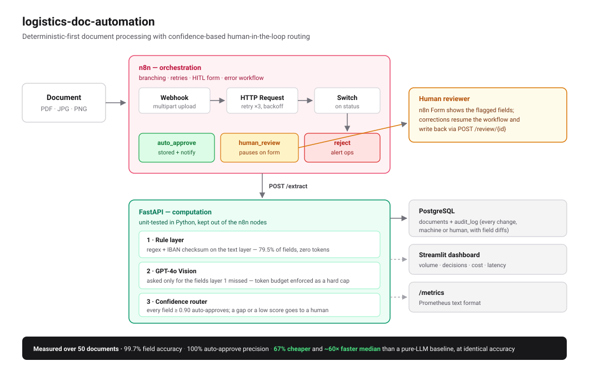
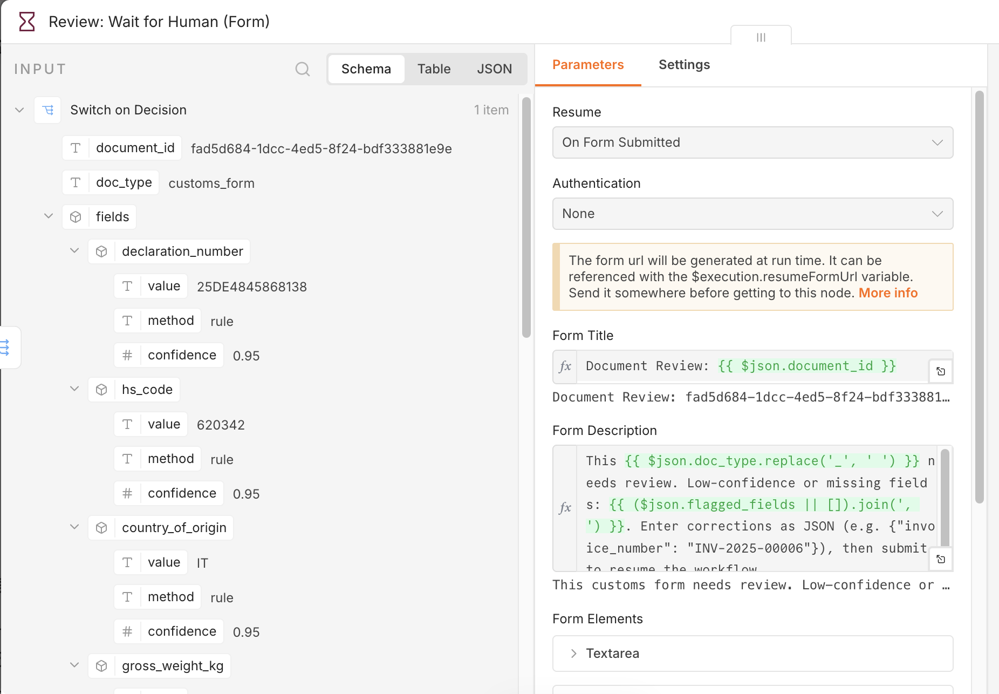
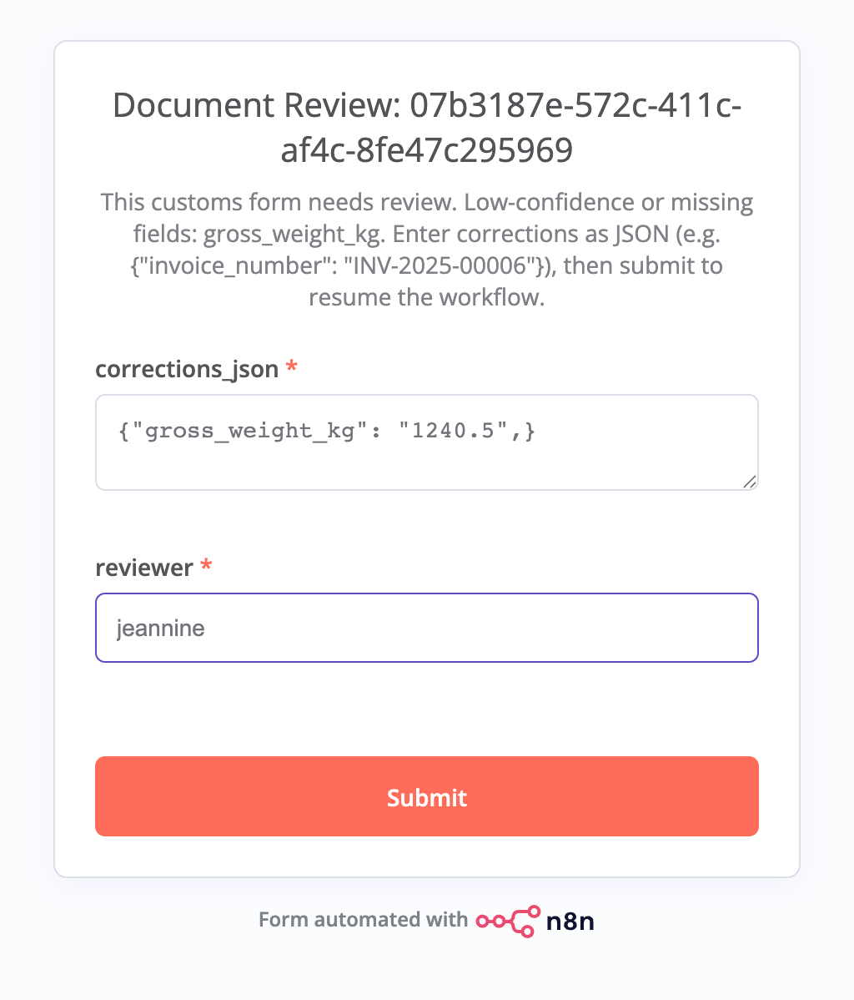
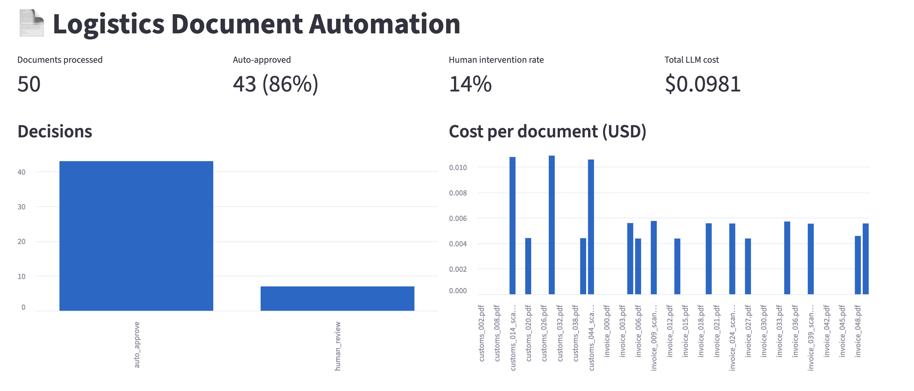
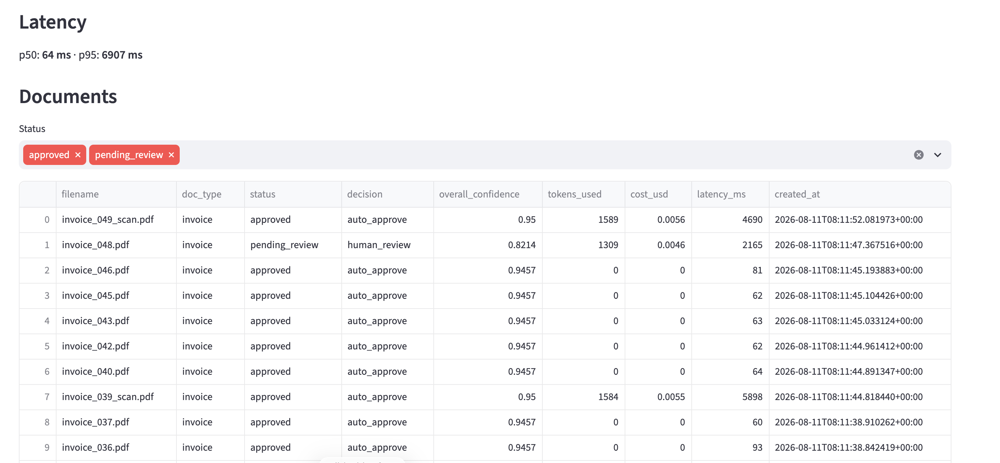

# logistics-doc-automation

**Supervised-autonomy document processing for logistics** — invoices and customs forms flow in, structured fields flow out. High-confidence extractions are auto-approved; anything uncertain is routed to a human. Orchestrated in **n8n**, computed by a **FastAPI** engine with a **deterministic-first** extraction strategy and **GPT-4o Vision** fallback.

> The goal is not "fully automated" — it's *supervised autonomy*: humans handle exceptions, not routine data entry.

## Architecture



**Separation of concerns:** n8n owns orchestration (branching, retries, HITL forms, error workflow); Python owns computation (extraction, validation, scoring) where it is unit-testable. n8n nodes stay thin.

### Why deterministic-first?

Fields with a fixed format (IBAN, VAT ID, dates, HS codes, amounts) are extracted from the PDF text layer with regexes and *validated* — an IBAN that passes its checksum is mathematically correct and gets confidence 1.0 without spending a single token. The LLM is only called for the fields the rule layer missed, and only asked for those fields. Result on the synthetic corpus: **100% of text-layer fields resolved by rules at zero cost**; the LLM budget is reserved for the hard cases (noisy scans, handwriting).

### Cost governance in code, not prompts

- `MAX_TOKENS_PER_DOC=8000` and `MAX_LLM_CALLS_PER_DOC=2` are hard caps — exceeded means abort and route to human review with `<budget_exceeded>` flagged, written to the audit log.
- Every response reports `tokens_used` and `cost_usd`; `/metrics` exposes totals in Prometheus format.

### Confidence-based routing

| Decision | Condition | Resulting status |
|---|---|---|
| `auto_approve` | every field present with confidence ≥ 0.90 | `approved` |
| `human_review` | any field missing, below 0.90, or budget exceeded | `pending_review` |
| `reject` | document type unrecognizable (confidence < 0.6) | `rejected` |

`decision` is what the engine concluded at extraction time and never changes —
it is the audit record. `status` is the document's current disposition and moves
when a reviewer acts. **Orchestration branches on `status`**: because `/extract`
is idempotent by file hash, re-sending an already-reviewed document replays its
stored `decision`, which is still `human_review`. Branching on that sent
resolved documents back to the review form, where the write-back failed with a
409 and produced a spurious review task and dead-letter entry.

Thresholds are env vars because they're a **business decision**: raising `AUTO_APPROVE_THRESHOLD` trades a higher human-intervention rate for a lower rate of wrong data entering the system.

## Quickstart

```bash
cp .env.example .env          # add your OPENAI_API_KEY (or set LLM_ENABLED=0 for rule-only mode)
docker compose up --build
```

| Service | URL |
|---|---|
| API (OpenAPI docs) | http://localhost:8000/docs |
| n8n | http://localhost:5678 |
| Streamlit dashboard | http://localhost:8501 |
| Metrics | http://localhost:8000/metrics |
| Health (readiness) | http://localhost:8000/health |
| Dead-letter backlog | http://localhost:8000/dead-letter |

### Operational behaviour

Failure handling is a design decision here, not an afterthought — each of these is verified by stopping the dependency and watching what happens:

| Concern | Behaviour |
|---|---|
| **Readiness vs. liveness** | `/health` executes `SELECT 1`, so it returns **503** when the database is unreachable; `/live` never touches a dependency. A health check that cannot reach the database reports `ok` while every real endpoint 500s — and a load balancer keeps sending traffic to an API that cannot answer. |
| **Startup ordering** | `api` waits for `postgres: service_healthy`; `n8n` and `dashboard` wait for `api: service_healthy`. Nothing starts against a dependency that is not ready. |
| **Container health** | Every service has a healthcheck and `restart: unless-stopped`. With the database stopped, `api` flips to `unhealthy` after 5 failed probes (~50 s) and returns to `healthy` on its own once the database is back — no manual restart. |
| **Transient database loss** | SQLAlchemy discards the dead connections and reconnects; requests succeed again without restarting the API. |
| **Upstream API failure** | The n8n `Call Extract API` node retries 3× with a 3 s backoff, then fails the execution, which triggers the **Error Handler** workflow via `errorWorkflow: LogisticsErrorWf`. |
| **Documents that fail for good** | The Error Handler writes the failure to a **dead-letter queue** (`POST /dead-letter`), so a document that exhausted every retry leaves a record instead of vanishing. `GET /dead-letter` is the requeue backlog; `dead_letter_open` in `/metrics` is the alert. |
| **LLM request ceiling** | The OpenAI client uses a 45 s timeout and no SDK-level retries. The SDK default is 600 s with 2 retries, which outlives the n8n node's 120 s cap — n8n would abandon a request that kept generating billable tokens. Worst case is now `MAX_LLM_CALLS_PER_DOC (2) × 45 s = 90 s`, inside n8n's cap, with retrying owned by n8n alone. |
| **Malformed reviewer input** | The HITL form's free-text JSON goes through a `Review: Validate Corrections` code node, which routes invalid input down a second branch into the dead-letter queue **with the reviewer's raw text preserved**, leaving the document `pending_review` so it can be redone. Parsing inline in the HTTP node threw a raw `SyntaxError` *after* the Wait node had been consumed — the correction was gone and the document was stranded. The node deliberately does not `throw`: n8n does not carry a thrown message across the task-runner boundary, so it arrives as `undefined [line N]` and loses the very input worth keeping. |

**Known limitation, verified not assumed:** if the API is the thing that is down, the dead-letter write fails too — the Error Handler cannot record into the service it is reporting on. Stopping `api` and posting a document produces a failed execution with *no* dead-letter row; n8n's own execution history is the durable record in that window, and the dead-letter node is marked `continueRegularOutput` so the alert branch still fires. Closing that gap properly needs a broker independent of the API (Redis/SQS), which is out of scope for a single-host demo.
| **Execution history** | `EXECUTIONS_DATA_PRUNE` with a 14-day window keeps the n8n database from growing without bound. |
| **Credential encryption** | `N8N_ENCRYPTION_KEY` is passed through only when set, so it can be pinned on a fresh volume without invalidating an existing one. |

Generate the synthetic test corpus (50 docs: EN/DE invoices, CN22/23-style customs forms, noisy scans, missing-field variants) and try one:

```bash
python data/generate_synthetic.py --count 50
curl -F "file=@data/samples/invoice_000.pdf" http://localhost:8000/extract | jq
```

### n8n setup

Open http://localhost:5678 once to create the local owner account (stored in the `n8n_data` volume — this is the self-hosted community edition, no n8n.io account or licence needed). Then import both workflows with one command:

```bash
docker compose cp n8n/workflows/. n8n:/tmp/workflows/
docker compose exec n8n n8n import:workflow --separate --input=/tmp/workflows
docker compose exec n8n n8n publish:workflow --id=LogisticsDocProc
docker compose exec n8n n8n publish:workflow --id=LogisticsErrorWf
docker compose restart n8n            # publishing via CLI needs a restart to take effect
```

Both workflows carry fixed IDs, so the import is idempotent (re-running updates in place) and `doc_processing` already points its **Error Workflow** at `Error Handler` — no manual wiring. The error handler has to be published too: n8n skips an unpublished error workflow and only logs *"is not active and cannot be executed"*.


> **n8n 2.x UI notes.** Activation was renamed — the top-right toggle is **Publish**, not *Active*. The GUI importer moved inside the editor: open a workflow, then **⋯ (top right) → Import from File**; pasting the JSON onto the canvas with `Cmd+V` also works.
>
> **Driving the HITL form from the shell.** The form URL is signed (`?signature=…`) and the endpoint requires `multipart/form-data`; sending `application/x-www-form-urlencoded` fails the execution with *"Expected multipart/form-data"*. Fields are posted **positionally** as `field-0`, `field-1`, … — not by their labels, which arrive as `null` if you use them:
>
> ```bash
> curl -X POST "http://localhost:5678/form-waiting/<id>?signature=<sig>" \
>   -F 'field-0={"total_amount": "999.99"}' -F 'field-1=jeannine'
> ```

Send a document to the webhook:

```bash
# text-layer invoice → rule layer only → auto_approve, zero tokens
curl -F "file=@data/samples/invoice_000.pdf" http://localhost:5678/webhook/doc-upload

# noisy scan → no text layer → GPT-4o Vision fallback → human_review branch
curl -F "file=@data/samples/invoice_004_scan.pdf" http://localhost:5678/webhook/doc-upload
```

The `human_review` branch pauses on an **n8n Form** — the reviewer corrects the flagged fields and the workflow resumes by writing back through `POST /review/{id}`.



### A reviewer's typo does not cost their work

The corrections box takes free-text JSON, so sooner or later someone submits a trailing comma:



Parsing this inline in the HTTP node threw a raw `SyntaxError` *after* the Wait node had been consumed: the execution failed, the typed correction was gone, and the document was stranded in `pending_review` with no way to resume it.

It now takes the validation node's **false** branch instead. The execution succeeds, and the branch that would have written to the database never runs:


`Review: Submit Corrections` is grey: nothing was written for a submission that could not be parsed. Opening the node that did run shows why this beats failing the execution — the reviewer's exact text survives:


`raw` still holds `{"gross_weight_kg": "1240.5",}` — the trailing comma and all — and the API returns the row it created (`id 2`, `status open`). `GET /dead-letter` returns the same record with the `document_id` attached. The document stays `pending_review`, so the review can be redone from what the reviewer actually typed rather than from memory.

> **n8n Cloud:** import the same JSON, then change the two HTTP nodes' base URL from `http://api:8000` to a publicly reachable URL for the API (e.g. a `cloudflared`/`ngrok` tunnel to `localhost:8000`).

A complete human-in-the-loop run in the **Executions** tab — webhook in, extraction, status switch, the reviewer's corrections validated and written back, every node on the path green:


## Evaluation

`python eval/evaluate.py --api http://localhost:8000` replays the corpus against ground truth (50 documents — 40 text-layer PDFs in English and German, 10 JPEG-compressed noisy scans with no text layer, 7 with a field genuinely absent).

### Deterministic-first vs. a pure-LLM baseline

The control group runs the identical pipeline with the rule layer switched off (`RULE_LAYER_ENABLED=0`), so every field goes to GPT-4o Vision. Same corpus, same thresholds, same model:

| Metric | **Deterministic-first** | Pure-LLM baseline |
|---|---|---|
| Field-level accuracy | 99.7% (333/334) | 99.7% (333/334) |
| Auto-approve precision | **100%** (43/43) | 100% (43/43) |
| Human intervention rate | 14% | 14% |
| Rule-layer coverage | **79.5%** of fields at zero token cost | 0% |
| Cost per document | **$0.00196** | $0.00589 |
| Latency p50 | **66 ms** | 4 098 ms |
| Latency p95 | 6 962 ms | 5 475 ms |

**Resolving 79.5% of fields deterministically cuts cost per document by 67% and median latency by 62×, at identical accuracy.** Nothing is traded away: both runs miss the same single field, and both auto-approve the same 43 documents. p95 is a wash because it is set by the scanned documents, which need the model either way — the rule layer removes the model from the *common* path, not the hard one.

> Accuracy, precision, intervention rate, rule coverage and cost are stable — the corpus is generated under `random.seed(42)`, so a re-run reproduces them to the cent. **Latency on the LLM path is not stable**: it is dominated by OpenAI response time and moves between runs. An earlier run of the identical corpus measured p50 65 ms / 3 768 ms and p95 5 440 ms / 5 526 ms. Read the p50 ratio as "~60× on the rule-served path", not as a precise constant; the cost and accuracy numbers are the load-bearing ones.

The number that matters most is **auto-approve precision: 100%**. Nothing incorrect was written to the database unattended.

### The one field both runs got wrong — and why it never reached the database

`invoice_048.pdf` is a hard sample whose total-amount line was deliberately removed. GPT-4o Vision reported `4720.55` anyway: a hallucinated total, invented for a field that does not exist in the document. Both runs made this error, because the rule layer also finds nothing to extract there and defers to the model.

The pipeline still did its job. The same deletion removed the currency, the missing field dropped the document below the auto-approve floor, and it was routed to **human review** rather than written to the database. This is the case the architecture exists for: the defence against a confident wrong answer is not a better prompt, it is refusing to auto-approve anything with a gap in it.

Reproduce the comparison — the control group is one env var, so both arms run the same code path:

```bash
python eval/evaluate.py --api http://localhost:8000                     # deterministic-first

docker compose run --rm -d --name baseline -p 8001:8000 \
  -e RULE_LAYER_ENABLED=0 -e DATABASE_URL=sqlite:////tmp/baseline.db api
python eval/evaluate.py --api http://localhost:8001                     # pure-LLM control
docker rm -f baseline
```

> Evaluate against a fresh database. `/extract` is idempotent by file hash, so a database that already holds these documents replays stored results instead of re-extracting — and any human corrections submitted through the review flow would be scored as extraction output.

### Deterministic-only mode

With `LLM_ENABLED=0` (no API key, no spend) the rule layer alone reaches 100% auto-approve precision on 34 documents at 30 ms p50, correctly routing all 10 scans and every missing-field document to human review — a usable extractor with zero LLM dependency, and the baseline the LLM layer is measured against.

## Dashboard

The Streamlit ops view at `http://localhost:8501` gives volume, decision mix, and cost at a glance:



Below the fold, a searchable document table and latency percentiles for debugging individual runs:



## Idempotency & audit

- Re-sending the same file (SHA-256 match) returns the stored result — no duplicate rows, no duplicate spend.
- Every state change is in `audit_log`: extraction, decision, reviewer corrections (with field-level diffs). Human corrections are stored with `method=human` — a ready-made dataset for future few-shot examples or fine-tuning.

## Tests

90 pytest tests, no API key needed (LLM mocked / disabled). Dependencies are
pinned so a rebuild reproduces the versions these numbers were measured on:

```bash
pip install -r api/requirements.txt -r requirements-dev.txt
pytest api/tests
python n8n/validate_workflows.py   # structural checks on the committed workflow JSON
```

The workflow JSON is treated as source: `validate_workflows.py` catches dangling
connections from a renamed node, unreachable nodes, and an `errorWorkflow` id
that no longer resolves — the last one is silent in n8n, which merely logs
*"is not active and cannot be executed"* and keeps going.

CI runs that suite and separately builds the images, starts the whole stack with
`--wait`, and asserts that `/health` turns 503 when postgres is stopped. Lint and
unit tests alone never touch the Dockerfiles or the compose file.

## Repo layout

```
api/            FastAPI app: routers/, engine/ (rules, llm_extractor, confidence, budget), models/, tests/
n8n/workflows/  doc_processing.json (main pipeline), error_handler.json
n8n/            validate_workflows.py — structural checks on the workflow JSON
data/           generate_synthetic.py, samples/, ground_truth.json
eval/           evaluate.py — field accuracy, precision, intervention rate, cost, latency
dashboard/      Streamlit ops view (volume, decisions, cost, latency)
```
